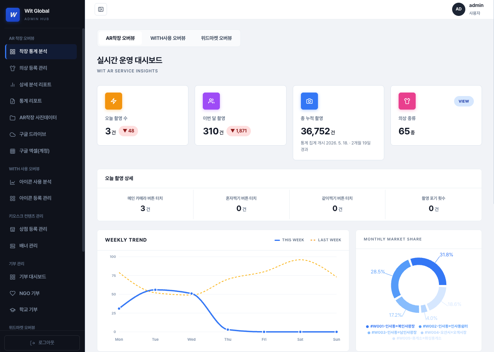

# Admin-fe

**WIT 키오스크 플랫폼의 관리자 웹**

## About this repository

WIT 키오스크 플랫폼의 운영자용 관리자 웹입니다. 현장에 설치된 키오스크를 원격으로 관리하고, 플랫폼에서 발생한 데이터를 조회하고 집계합니다.

관리 대상은 키오스크(버튼 배치·자막·배너·이용 통계), 상점과 상품, 기부(캠페인·단체·학교), 결제와 배송·환불, 의상, 그리고 사용자 계정입니다. 권한은 두 단계로 나뉘어, 관리자는 전체를 보고 판매자 계정은 제한된 메뉴와 전용 대시보드만 봅니다.

이 저장소는 화면만 담당합니다. 데이터는 전부 형제 저장소인 admin-be 한 곳에서 오고 중간 서버는 없습니다. 화면 중에는 실제 키오스크 기기 화면을 픽셀 단위로 재현한 미러가 있는데, 이는 kiosk-electron의 레이아웃을 CSS로 이식한 것이라 기기 앱이 바뀌면 수동으로 맞춰야 합니다.



로그인하면 위와 같은 실시간 운영 대시보드가 첫 화면으로 열립니다. 좌측 사이드바에서 AR 착장, WITH 사용, 키오스크 콘텐츠, 기부, 위드마켓 영역으로 이동합니다.

## Built With

* TypeScript
* React 19
* Vite 7
* React Router v7 (HashRouter)
* TanStack Query
* Zustand
* Axios
* CSS Modules

통계 화면에 Recharts, 자막과 다국어 시트 편집에 react-datasheet-grid, 리포트 내보내기에 xlsx·docx·jsPDF·html2canvas를 함께 씁니다.

## Getting started

### Prerequisites

* **Node.js:** v20.19.0 이상 또는 v22.12.0 이상 (Vite 7 요구사항)
* **npm:** Node.js에 포함된 버전

### Installation

1. **Repository 클론**

```bash
git clone https://github.com/wit-project-sku/admin-fe.git
cd admin-fe
```

2. **의존성 설치**

```bash
npm install
```

3. **환경 변수 설정**

```bash
# .env.example 파일을 복사하여 .env 파일을 생성하고, 각 항목을 입력합니다.
cp .env.example .env
```

값은 인프라 담당자에게 받으세요. 세 개의 키가 들어갑니다.

```
VITE_API_BASE_URL     공개 API 주소
VITE_APP_API_URL      인증 API 주소 (없으면 위 값으로 폴백)
VITE_API_LOCAL_URL    로컬 백엔드 주소
```

VITE_로 시작하는 값은 빌드할 때 번들에 그대로 인라인되어 브라우저에서 보입니다. 비밀로 지켜야 하는 값은 넣지 마세요. 주소도 소스에 직접 쓰지 말고 `import.meta.env`로 읽습니다.

### Run Project

```bash
npm run dev
```

http://localhost:5173 에서 로그인 화면이 뜨고 로그인에 성공하면 정상입니다.

빌드는 `npm run build`, 타입 검사는 `npm run typecheck`, 린트는 `npm run lint`, 빌드 결과 확인은 `npm run preview`입니다. 작업이 끝났는지 판단할 때는 빌드를 기준으로 삼습니다.

### Before You Start

세 가지를 모르면 반나절을 씁니다.

**포트는 5173으로 고정입니다.** stage API가 CORS로 허용하는 로컬 포트가 5173, 3000, 8081뿐입니다. 다른 포트로 띄우면 로그인부터 모든 요청이 Failed to fetch로 죽습니다. `vite.config.ts`에 5173이 박혀 있으니 그대로 두세요.

**React와 React DOM은 버전이 같아야 합니다.** 둘 다 19.2.4로 정확히 고정돼 있고 package.json의 overrides가 이를 강제합니다. 버전이 어긋나면 런타임에 크래시합니다. 의존성을 건드렸다면 두 패키지를 같은 버전으로 맞춘 뒤 자막 그리드 페이지가 뜨는지 확인하세요.

**타입 에러 열한 건은 원래 있던 것입니다.** 빌드에는 타입 검사 게이트가 없어서 `npm run typecheck`를 돌리면 기존 에러가 그대로 나옵니다. 전부 없애려 하지 말고, 내가 손댄 파일에서 새 에러가 늘지 않았는지만 확인하세요.

## Project Structure

```
src/
├── main.tsx → App.tsx → routes/Router.tsx
├── pages/              라우트 단위 페이지
├── features/           도메인 로직
│                       kiosk · donations · products · shops
│                       outfits · reports · dashboard · users
├── hooks/<도메인>-api/  react-query 훅과 타입, fetcher
├── components/         common(공용 UI) · modal(관리 플로우별 모달)
├── layouts/            사이드바와 헤더
├── stores/             인증 · UI 상태
└── utils/ hooks/ constants/ types/
```

진입점은 main.tsx이고 라우터가 전체를 QueryClientProvider와 HashRouter로 감쌉니다. 각 라우트는 지연 로딩되며 인증 가드와 권한 가드를 통과해야 열립니다.

기능을 찾을 때는 features 아래 도메인 폴더부터 봅니다. 페이지는 얇게 두고 로직은 features에 있습니다. 서버 호출을 추가할 자리는 hooks 아래 도메인별 api 폴더입니다. 권한 규칙은 utils/roleAccess.ts 한 곳이 기준입니다.

경로 별칭은 vite.config.ts와 tsconfig.json 양쪽에 선언돼 있습니다.

## Deployment

배포 브랜치는 main 하나입니다. main에 push하면 Vercel이 자동으로 프로덕션에 배포하고, 그 외 브랜치는 vercel.json의 git.deploymentEnabled가 막아 아무것도 배포되지 않습니다. 별도의 배포 명령이나 승인 단계는 없습니다.

작업은 develop_v3에서 하고, 배포할 때 main으로 머지합니다. 그래서 main 머지는 요청받았을 때만 합니다 — README 한 줄만 고쳐도 프로덕션이 바뀝니다.

이 구조 이전에는 develop_v3가 배포 브랜치였고 main은 6월 코드에 머물러 있었습니다. 2026-09-07 main에 문서 커밋이 들어가면서 옛 코드가 프로덕션으로 올라가 관리자 웹 전 경로가 404가 됐습니다(main에는 SPA rewrite를 넣은 vercel.json이 없었습니다). 두 브랜치를 동기화하고 배포 브랜치를 main으로 일원화한 이유입니다.

## References

* [Swagger](https://api-stage-v3.witteria.com/swagger-ui/index.html) — 백엔드 API 명세
* [admin-be](../admin-be/README.md) — 백엔드 저장소. 코드 규약과 설계 결정 이력
* [wit-platform-docs](../wit-platform-docs/README.md) — 플랫폼 전체 그림, 온보딩, 인프라, 배포, 장애 대응
* [wit-platform-docs / 용어집](../wit-platform-docs/docs/06-glossary.md) — 도메인 용어

API 명세는 Swagger가 유일한 원천입니다. 별도의 API 문서를 만들지 않으니 항상 여기를 보세요. 문서는 호출 주체별로 그룹이 나뉘어 있으니 관리자 그룹만 보면 됩니다.
